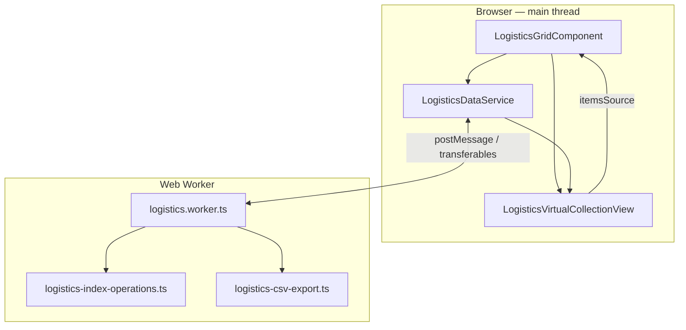

# Logistics grid — high-level design

**Audience:** architects, tech leads, and engineers onboarding to the module.  
**Companion doc:** [wijmo-grid-flow-design.md](./wijmo-grid-flow-design.md) (low-level design, message contracts, Wijmo integration details).

---

## 1. Purpose and scope

The **logistics** Angular module renders a **Wijmo FlexGrid** over **very large tabular datasets** (target order: **~300k rows × ~80 columns**) without freezing the browser. The grid supports:

- Columnar data in **TypedArrays** and **dictionary-encoded** string-like columns  
- **Worker-based** sort, global search, and column filters  
- **Virtual rows** (no per-row plain objects in memory)  
- Limited **inline editing** (`rNo`, `sOLNo`) with main + worker consistency  
- **CSV export** of the **current visible row set** (worker-generated)

**Out of scope (HLD):** product requirements, UX copy, non-grid features, backend APIs (this build uses **mock data** generated in the worker).

---

## 2. Design goals

| Goal                             | Strategy                                                                                            |
| -------------------------------- | --------------------------------------------------------------------------------------------------- |
| Responsive UI                    | Offload O(N) work to a **dedicated Web Worker**.                                                    |
| Bounded memory per row           | **Column-oriented** storage; **one** `Uint32Array` (`rowOrder`) for view order.                     |
| Correct grid UX                  | Wijmo for rendering and filter UI; **custom** sort/search/filter semantics aligned with `rowOrder`. |
| Editable cells without full sync | Main thread owns **live** buffers; worker keeps **clones** for algorithms + **CELL_EDIT** patches.  |

---

## 3. Logical architecture

**Responsibilities**

- **LogisticsGridComponent** — FlexGrid, toolbar (search, clear filters, export CSV), Wijmo filter wiring, header sort interception, edit handlers.  
- **LogisticsDataService** — Worker lifecycle, signals (`data`, `view`, `sortModel`, …), request methods, applying `**rowOrder`** updates to the chunk + collection view.  
- **LogisticsVirtualCollectionView** — Wijmo `CollectionView` whose `sourceCollection` is a **Proxy** over a sparse array; each visible index maps through `**rowOrder`** into TypedArrays / dictionaries.  
- **Worker** — Data generation (mock), clones for post-transfer reads, `**currentRowOrder`**, filter/search/sort pipelines, CSV materialization, **CELL_EDIT** on worker clones.

---

## 4. Data architecture (conceptual)

### 4.1 Columnar chunk (`LogisticsDataChunk`)

All cell values are addressed by **physical row index** `p ∈ [0, totalRows)`:

- **Numeric / flags / timestamps:** `numericColumns[name][p]`  
- **Dictionary columns:** `dictMaps[name][ dictColumns[name][p] ]`  
- **Long text:** `stringColumns[name][p]`

### 4.2 View order (`rowOrder`)

- `**rowOrder`** is a `**Uint32Array**` of length = number of rows **currently shown** (after filter/search).  
- **View row `i`** reads physical row `**rowOrder[i]**`.  
- **Sort, search, and column filter** only change `**rowOrder`** (and possibly its length); column buffers are not permuted.

### 4.3 Dual copies after load

On initial load, **ArrayBuffers** are **transferred** to the main thread for zero-copy handoff. The worker keeps **clones** (`sortNumericColumns`, `sortDictColumns`) for algorithms. **Inline edits** update:

1. Main: `chunk.numericColumns` (what the grid reads).
2. Worker: `**sortNumericColumns`** via `**CELL_EDIT**` so sort/filter/export see new values.

The **Apache Arrow `Table`** built during generation is **not** updated on edit; runtime logic uses the TypedArray column maps, not Arrow mutation APIs.

---

## 5. Major user-visible flows (summary)

| Flow               | Main thread                                                                 | Worker                                                                   |
| ------------------ | --------------------------------------------------------------------------- | ------------------------------------------------------------------------ |
| **Load**           | Receives chunk + transferables; builds `LogisticsVirtualCollectionView`.    | Generates data; clones for continued reads; posts `DATA_LOADED`.         |
| **Sort (header)**  | Cancels default FlexGrid sort; sends `SortDescriptor[]` (or single column). | Sorts `**currentRowOrder`**; returns new `rowOrder`.                     |
| **Global search**  | Debounced query + highlight signal; sends query + `sortModel`.              | Subset of rows → optional resort → new `rowOrder`.                       |
| **Column filters** | Serializes Wijmo filters; bypasses CV row filter (`_filter → true`).        | AND filters + optional search text + sort → new `rowOrder`.              |
| **Cell edit**      | Writes main TypedArray; posts `CELL_EDIT`.                                  | Writes `**sortNumericColumns`** for editable columns.                    |
| **CSV export**     | Sends column bindings/headers; receives CSV string; triggers download.      | Walks `**currentRowOrder`** + columnar stores; builds CSV with escaping. |

**Stale replies:** sort / search / filter / export use **sequence numbers** so older worker responses are ignored after a newer request.

---

## 6. Cross-cutting concerns

- **Performance:** Hot paths avoid allocating one object per row; worker uses shared `**logistics-index-operations.ts`** (sort, search scan, column filter). CSV builds in **row batches** before joining segments.  
- **Wijmo quirks:** Virtual/proxy rows require small **FlexGrid patches** (e.g. filter init, optional row/editor guards)—see LLD.  
- **Types:** Shared contracts in `**logistics.types.ts`** (payloads, `LogisticsDataChunk`, worker message unions).  
- **Testing / scale:** Mock row count is configurable in the worker; architecture is intended to scale toward **~300k** rows given sufficient memory for buffers and export size.

---

## 7. Module map (high level)

| Area                            | Primary files                                                                                        |
| ------------------------------- | ---------------------------------------------------------------------------------------------------- |
| UI shell                        | `logistics-grid.component.ts`, `app.component.ts`                                                    |
| State + worker bridge           | `logistics-data.service.ts`                                                                          |
| Virtual collection              | `logistics-virtual-collection-view.ts`                                                               |
| Worker orchestration            | `logistics.worker.ts`                                                                                |
| Sort / search / filter (shared) | `logistics-index-operations.ts`                                                                      |
| CSV                             | `logistics-csv-export.ts`                                                                            |
| Wijmo sort glyphs only          | `logistics-sort-wijmo.ts`                                                                            |
| Filter serialize + culture      | `logistics-wijmo-filter-serialize.ts`, `logistics-flexgrid-filter-culture.ts`                        |
| Types + worker contracts        | `logistics.types.ts`                                                                                 |
| Editable columns helpers        | `logistics-editable-columns.ts`                                                                      |
| Dictionary encoding (load)      | `dictionary-encoder.ts`                                                                              |
| FlexGrid patches                | `logistics-flexgrid-filter-virtual-patch.ts`, `logistics-flexgrid-virtual-row-patch.ts` (if present) |

---

## 8. References

- **Low-level design:** [wijmo-grid-flow-design.md](./wijmo-grid-flow-design.md) — update that document when adding worker message types or changing CV behavior; keep this HLD aligned at a conceptual level.

---

## 9. Document control

| Version | Notes                                                                                                  |
| ------- | ------------------------------------------------------------------------------------------------------ |
| 1.0     | Initial HLD: worker/columnar/virtual-row model, dual-buffer edit strategy, CSV export, pointer to LLD. |

